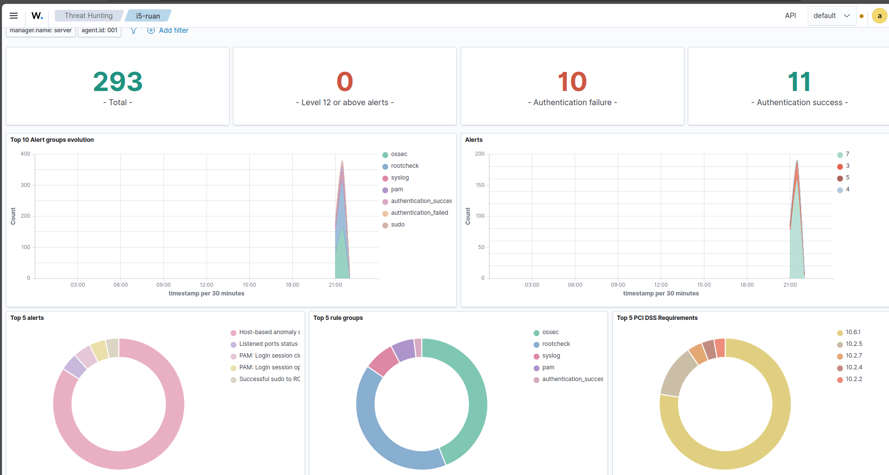
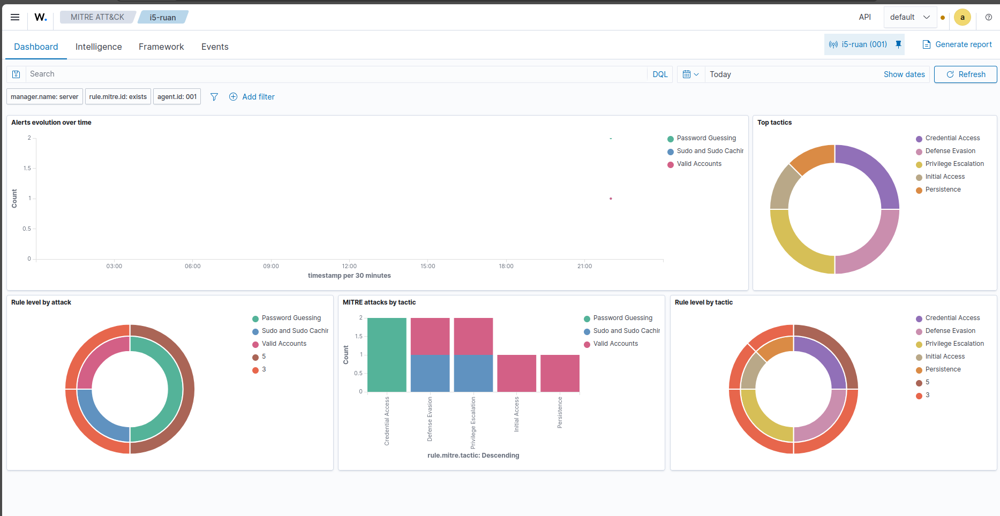
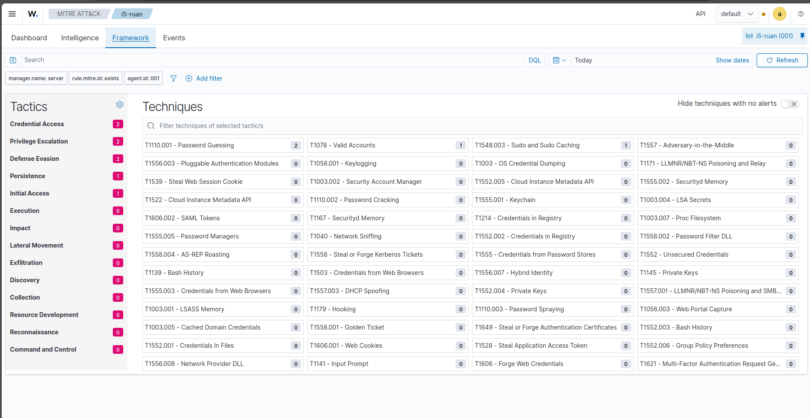
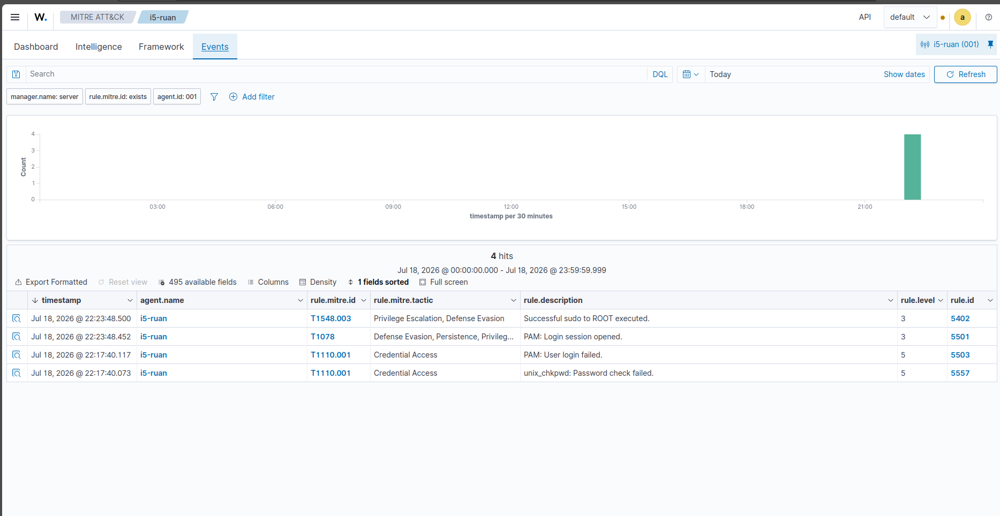

# SOC Lab — Ambiente de Monitoramento com Wazuh

## Arquitetura
- **Servidor SIEM:** Ubuntu 24.04 + Wazuh 4.14.6
- **Endpoint monitorado:** Ubuntu 24.04 + Wazuh Agent

## Ferramentas utilizadas
- Wazuh SIEM
- MITRE ATT&CK Framework
- PowerShell / Bash para análise

## Detecções realizadas
| Técnica MITRE | Tática | Descrição |
|---|---|---|
| T1110.001 | Credential Access | Password Guessing detectado |
| T1548.003 | Privilege Escalation | Sudo e Sudo Caching |
| T1078 | Defense Evasion | Valid Accounts |

## Screenshots

### Threat Hunting Dashboard

### MITRE ATT&CK Dashboard

### MITRE ATT&CK Framework

### MITRE Events

